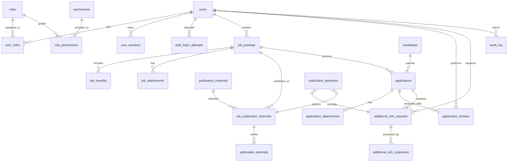
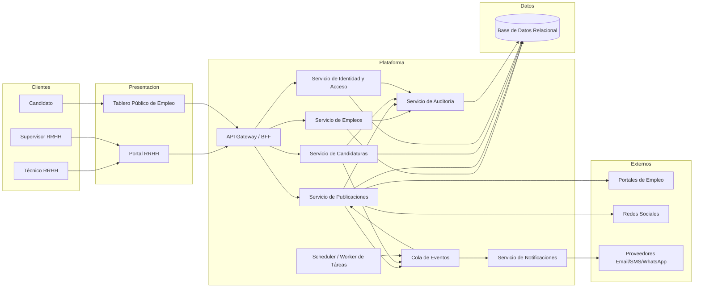
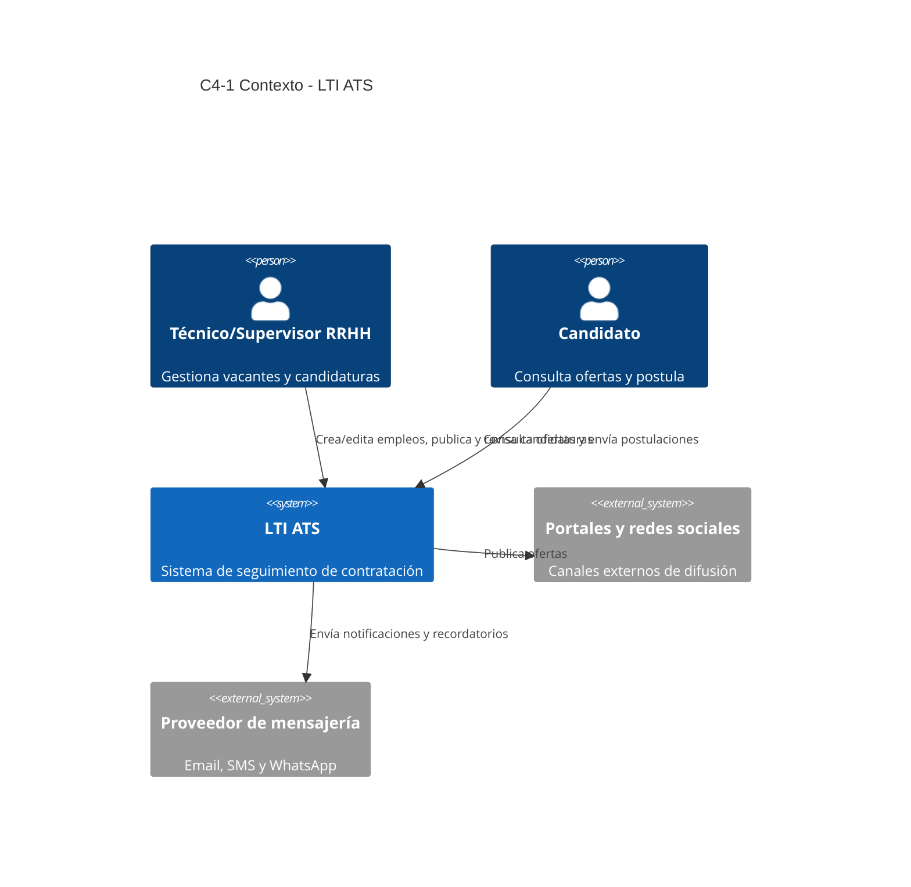
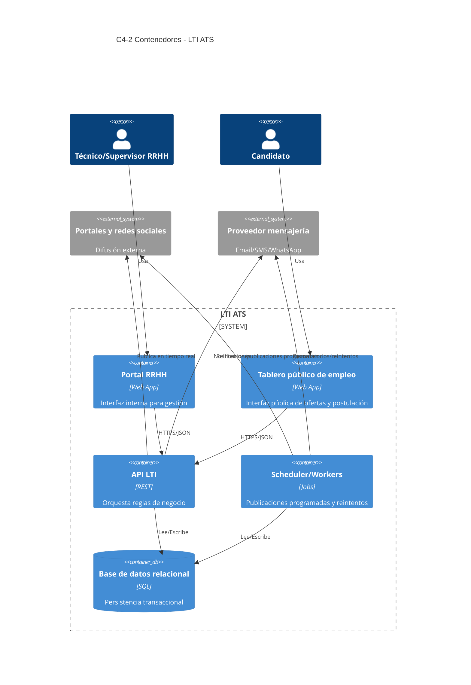
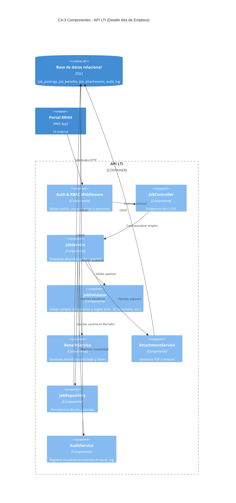

# LTI-PJM - Especificaciones iniciales del proyecto

Este archivo centraliza las especificaciones iniciales del proyecto dentro de la carpeta LTI-PJM.

## Estado inicial

- Archivo creado para consolidar las especificaciones base del proyecto.
- Pendiente de incorporar el detalle funcional y técnico inicial.

## Descripción breve del software LTI

LTI es un Applicant-Tracking System (ATS) que ayuda a los equipos de Recursos Humanos a gestionar y dar seguimiento al proceso de contratación de personal. El flujo inicia cuando RRHH publica una vacante en un tablero digital público; a partir de ahí, el sistema distribuye automáticamente esa oferta en redes sociales y en portales de empleo asociados para ampliar su alcance y acelerar la captación de candidatos.

Los candidatos visualizan esas ofertas en los distintos canales y presentan sus solicitudes. Un técnico de selección del departamento de RRHH revisa dichas postulaciones, realiza una preselección e inicia el proceso de pruebas. Con base en los resultados, se define qué candidatos avanzan a la siguiente etapa.

Posteriormente se agenda y ejecuta la fase de entrevistas. A partir de la evaluación final de esta etapa, se contrata al candidato o candidatos seleccionados. El cierre del proceso incluye la preparación de la documentación necesaria para formalizar la contratación.

## Casos de uso principales - Versión 1

Esta primera versión define los 3 casos de uso principales para una primera iteración funcional. Los detalles de validaciones, estados intermedios y permisos finos se refinan en la siguiente iteración.

## Reglas transversales del sistema

- El sistema requiere autenticación y autorización basada en roles.
- Un usuario solo puede operar si está activo.
- La disponibilidad de pantallas y funcionalidades depende del rol del usuario.
- Debe existir gestión de usuarios para altas, bajas lógicas, activación y asignación de roles.
- Toda visualización y modificación de datos debe registrarse con trazabilidad completa (usuario, acción, fecha, hora, entidad afectada y detalle del cambio).
- Estados de una publicación de empleo: Borrador, Oculto, Publicado y Cerrado.
- Solo usuarios con rol Supervisor pueden ejecutar la publicación de una oferta.
- Los técnicos pueden gestionar estados no finales del ciclo interno (por ejemplo Borrador, Oculto y Cerrado) según permisos asignados.
- Antes de publicar, el sistema debe mostrar una vista previa de la oferta tal como la verá el candidato y requerir aprobación explícita del usuario publicador.

### CU-01 - Crear empleos

- Codificación: CU-01
- Descripción: Permite registrar una oferta de empleo con toda la información necesaria para su posterior publicación.
- Actor principal: Técnico de selección (RRHH) y Supervisor RRHH
- Precondiciones:
	- El usuario ha iniciado sesión en el sistema y se encuentra activo.
	- El usuario tiene rol Técnico de selección o Supervisor con permisos para crear ofertas.
	- Existen catálogos base cargados (área, tipo de contrato, país, provincia, ciudad y beneficios).
- Postcondiciones:
	- La oferta queda almacenada en estado Borrador.
	- Se registra trazabilidad de creación y de toda visualización o modificación asociada.
	- La oferta queda disponible para edición posterior y validación de completitud para publicación.
- Flujo principal:
	1. El técnico o supervisor accede al módulo de gestión de empleos.
	2. Selecciona la opción Crear empleo.
	3. El sistema muestra el formulario de alta de oferta.
	4. El usuario completa los datos de la vacante.
	5. El usuario adjunta documentos PDF y/o enlaces web, si aplica.
	6. El usuario confirma el guardado.
	7. El sistema valida la información obligatoria y reglas de formato.
	8. El sistema guarda la oferta en estado Borrador, registra trazabilidad y muestra confirmación.
- Flujos alternativos:
	1. Guardado parcial: el usuario guarda sin completar campos opcionales y continúa luego.
	2. Carga de beneficios no estándar: el usuario selecciona entre beneficios predefinidos y agrega otros beneficios en texto libre.
	3. Sin plantillas en MVP: la creación se realiza desde cero; el uso de plantillas queda como mejora futura.
- Flujos de excepción:
	1. Datos obligatorios incompletos: el sistema no guarda y muestra errores por campo.
	2. Descripción con menos de 30 caracteres: el sistema bloquea el guardado y muestra mensaje de validación.
	3. Usuario inactivo o sin permisos: el sistema bloquea el acceso al caso de uso.
	4. Error de persistencia: el sistema informa fallo técnico y no confirma creación.
- Reglas de negocio:
	1. Campos obligatorios en CU-01: título, descripción, área, modalidad, país, provincia, ciudad y tipo de contrato.
	2. Campos opcionales en CU-01: dirección, salario y fecha límite.
	3. La descripción debe tener un mínimo de 30 caracteres.
	4. Ubicación se registra desglosada en país, provincia, ciudad y dirección (dirección opcional).
	5. Beneficios admitidos: ticket alimentación, ticket transporte, guardería, seguro de vida, seguro médico, formación, entre otros.
	6. La vacante puede incluir adjuntos PDF y/o enlaces web.
	7. Una oferta nueva siempre se crea en estado Borrador.
	8. Un empleo está listo para publicar cuando todos los campos obligatorios han sido completados.
- Criterios de aceptación:
	1. Dado un técnico o supervisor activo con permisos, cuando completa los campos obligatorios y guarda, entonces la oferta queda en estado Borrador.
	2. Dada una descripción menor de 30 caracteres, cuando intenta guardar, entonces el sistema muestra validación y no crea la oferta.
	3. Dado que dirección, salario o fecha límite no se completan, cuando se guarda con campos obligatorios válidos, entonces la oferta se crea correctamente.
	4. Dado un guardado exitoso, cuando se consulta la oferta, entonces se visualiza el historial de trazabilidad de creación y cambios.

### CU-02 - Publicar empleos

- Codificación: CU-02
- Descripción: Permite publicar una oferta creada para hacerla visible en el tablero público de empleo, en redes sociales y en portales de empleo asociados.
- Actor principal: Supervisor RRHH
- Actor secundario: Técnico de selección (solo para cambios de estado a Oculto)
- Precondiciones:
	- Existe una oferta en estado Borrador u Oculto apta para publicar.
	- El usuario publicador ha iniciado sesión, está activo y tiene rol Supervisor.
	- La oferta tiene completos todos los campos obligatorios.
	- Están configuradas las integraciones con canales de difusión disponibles.
- Postcondiciones:
	- La oferta queda en estado Publicado en la fecha de publicación definida.
	- La oferta queda visible en el tablero público de empleo (canal obligatorio).
	- Se genera registro de canales objetivo y resultado por canal.
	- En caso de fallo de canal externo, se ejecutan reintentos y se registra la evidencia completa.
- Flujo principal:
	1. El supervisor accede al detalle de la oferta y pulsa Publicar.
	2. El sistema muestra pantalla resumen de la oferta y vista previa tal como la verá el candidato.
	3. El supervisor selecciona los canales externos integrados (portales y redes) en los que desea publicar.
	4. El supervisor define la fecha de publicación.
	5. El supervisor confirma la acción con el botón de aprobación de publicación.
	6. El sistema agenda la publicación para la fecha indicada y registra auditoría de la acción.
	7. En la fecha programada, el sistema publica en el tablero público de empleo.
	8. El sistema publica en los canales externos seleccionados.
	9. El sistema registra resultado por canal y notifica estado final de la operación.
- Flujos alternativos:
	1. Cambio previo a publicación: antes de la fecha programada, el supervisor puede modificar fecha de publicación o cambiar estado de la oferta.
	2. Cambio a Oculto: un técnico o supervisor puede mover una oferta Publicada a estado Oculto para evitar nuevas postulaciones.
	3. Reintento manual de canal fallido: solo el supervisor puede reintentar una publicación fallida de un canal específico.
- Flujos de excepción:
	1. Oferta no válida para publicar: el sistema bloquea la acción y detalla faltantes.
	2. Falla en canal externo: el sistema reintenta automáticamente hasta 3 veces con 4 horas entre intentos.
	3. Fallo tras el tercer intento: el sistema marca canal como fallido definitivo y envía correo electrónico al publicador.
	4. Falla del tablero público de empleo: el sistema bloquea el cierre de la publicación y registra un error crítico.
- Reglas de negocio:
	1. Solo el rol Supervisor puede aprobar y ejecutar una publicación.
	2. El tablero público de empleo es el canal obligatorio de publicación.
	3. Los canales externos (portales y redes) son seleccionables por el publicador entre las integraciones activas.
	4. La publicación en redes sociales debe enlazar siempre a la publicación del tablero público de empleo.
	5. Las fallas en un canal no deben impedir la publicación en el resto de canales.
	6. Reintentos automáticos por canal fallido: máximo 3 intentos, con 4 horas entre cada intento.
	7. Solo el supervisor puede ejecutar reintentos manuales en canales fallidos.
	8. Un empleo Publicado puede cambiar a Oculto por acción de técnico o supervisor; las candidaturas vigentes se mantienen.
	9. Al pasar a Oculto, la oferta deja de verse en el tablero público de empleo y se pausan las publicaciones en portales de trabajo.
	10. Campos de trazabilidad obligatorios en CU-02: usuario, fecha/hora, estado anterior/nuevo, canales objetivo, resultado por canal, motivo de fallo e identificador de transacción.
- Criterios de aceptación:
	1. CA-01: Dado un supervisor activo con sesión activa, cuando accede a la pantalla de oferta, entonces puede pulsar el botón Publicar.
	2. CA-02: Dado un supervisor activo con sesión activa, cuando pulsa Publicar, entonces visualiza una pantalla resumen de la oferta y un botón de confirmación Publicar.
	3. CA-03: Cuando un supervisor o técnico cambia el estado de una publicación a Oculto, entonces la oferta deja de verse en el tablero público de empleo y se pausa la publicación en portales de trabajo, manteniendo vigentes las candidaturas actuales.
	4. CA-04: Cuando un supervisor o técnico accede a la pantalla de publicación o realiza cambios, entonces el evento queda registrado en la tabla de auditorías.
	5. Dado un canal externo fallido, cuando se ejecutan los 3 reintentos automáticos sin éxito, entonces el sistema envía un correo electrónico al publicador y mantiene la evidencia de fallo.

### CU-03 - Revisar candidaturas

- Codificación: CU-03
- Descripción: Permite revisar solicitudes de candidatos para preseleccionar perfiles y avanzar a pruebas y entrevistas.
- Actor principal: Técnico de selección (RRHH) y Supervisor RRHH
- Precondiciones:
	- Existe al menos una oferta publicada con candidaturas recibidas.
	- El usuario revisor ha iniciado sesión, está activo y tiene permisos para revisar candidaturas.
	- La candidatura contiene información base para revisión (CV, carta, respuestas del formulario, experiencia, estudios y disponibilidad).
- Postcondiciones:
	- Cada candidatura revisada queda con estado registrado: Pendiente, En revisión, Preseleccionada, Descartada o En espera.
	- Las candidaturas en estado Preseleccionada avanzan directamente a la etapa de pruebas.
	- Toda visualización y modificación queda registrada en auditoría y trazabilidad.
- Flujo principal:
	1. El técnico o supervisor accede al listado de candidaturas por oferta.
	2. Selecciona una candidatura.
	3. El sistema muestra perfil, CV, carta, respuestas del formulario, experiencia, estudios y disponibilidad del candidato.
	4. El revisor cambia el estado de la candidatura a En revisión.
	5. El revisor evalúa la candidatura y registra decisión con justificación.
	6. Si la decisión es Preseleccionada, la candidatura pasa automáticamente a la etapa de pruebas.
	7. El sistema guarda la decisión, actualiza estado y registra auditoría.
	8. El sistema notifica el estado final de la revisión.
- Flujos alternativos:
	1. Solicitud de información adicional: el revisor cambia la candidatura a estado En espera y solicita datos adicionales.
	2. El sistema envía correo con enlace a la candidatura para que el candidato responda.
	3. El candidato agrega texto libre y adjunta documentación solicitada; la información queda anexada al expediente.
	4. La solicitud incluye fecha límite de entrega y recordatorios diarios por canales seleccionados: WhatsApp, email y/o SMS.
	5. Una vez recibida la información, la candidatura vuelve a revisión y continúa el flujo principal.
- Flujos de excepción:
	1. Documentación ilegible o incompleta: el sistema impide cerrar la revisión y marca una observación.
	2. Candidatura ya evaluada por otro usuario: al intentar guardar, el sistema informa al último usuario de que la candidatura ya fue revisada y evita una sobrescritura inconsistente.
	3. Vencimiento de fecha límite de información adicional: el sistema marca alerta y mantiene estado En espera hasta acción del revisor.
	4. Falla en canal de recordatorio: el sistema registra incidencia y mantiene envío por los demás canales seleccionados.
- Reglas de negocio:
	1. La revisión de candidaturas puede ser realizada por técnicos y supervisores con permisos.
	2. Estados válidos en CU-03: Pendiente, En revisión, Preseleccionada, Descartada y En espera.
	3. No se puede avanzar un candidato a pruebas sin estado Preseleccionada.
	4. Toda preselección debe incluir justificación obligatoria.
	5. No existe un sistema de puntuación automática (`scoring`) en el MVP; la evaluación es cualitativa.
	6. No hay revisión colaborativa en el MVP.
	7. Ante concurrencia de revisión, el último en guardar debe ser informado de que la candidatura ya fue revisada.
	8. Se puede solicitar información adicional con fecha límite, respuesta por enlace y adjuntos.
	9. Los recordatorios diarios de información adicional se envían por canales seleccionados: WhatsApp, email y/o SMS.
	10. Trazabilidad obligatoria en CU-03: usuario, fecha/hora, estado anterior/nuevo, comentarios, justificación y evidencia consultada.
- Criterios de aceptación:
	1. Dado un técnico o supervisor activo con permisos, cuando accede a una candidatura, entonces puede cambiarla a estado En revisión y registrar decisión.
	2. Dada una candidatura Preseleccionada con justificación, cuando se guarda la decisión, entonces la candidatura avanza automáticamente a pruebas.
	3. Dada una solicitud de información adicional, cuando el revisor la emite, entonces el sistema envía correo con enlace y habilita texto libre y adjuntos para el candidato.
	4. Dada una solicitud de información adicional activa, cuando se configuran canales de recordatorio, entonces el sistema envía recordatorios diarios por WhatsApp, email y/o SMS hasta la fecha límite.
	5. Dado un conflicto de concurrencia, cuando un segundo usuario intenta guardar después de una revisión previa, entonces el sistema informa que la candidatura ya fue revisada y evita sobrescritura inconsistente.
	6. Dado acceso o cambio sobre la candidatura por técnico o supervisor, cuando ocurre la acción, entonces queda registro en tabla de auditorías.

## Modelo de datos relacional propuesto

Este modelo soporta CU-01 (crear empleos), CU-02 (publicar empleos), CU-03 (revisar candidaturas), gestión de usuarios, autenticación/autorización por roles y trazabilidad completa.

### Entidades principales

- Seguridad y usuarios: users, roles, permissions, role_permissions, user_roles, user_sessions, auth_login_attempts.
- Empleos y publicación: job_postings, job_benefits, job_attachments, publication_channels, job_publication_channels, publication_attempts.
- Candidaturas y revisión: candidates, applications, application_attachments, application_reviews, additional_info_requests, additional_info_responses, notification_deliveries.
- Auditoría transversal: audit_log.

### Diccionario de datos

#### users

| Campo | Tipo | Nulo | Clave | Descripción |
|---|---|---|---|---|
| id | BIGINT | No | PK | Identificador del usuario |
| email | VARCHAR(255) | No | UK | Correo único de acceso |
| password_hash | VARCHAR(255) | No |  | Hash de contraseña |
| full_name | VARCHAR(150) | No |  | Nombre completo |
| is_active | BOOLEAN | No |  | Usuario activo/inactivo |
| last_login_at | DATETIME | Si |  | Último acceso exitoso |
| created_at | DATETIME | No |  | Fecha de creación |
| updated_at | DATETIME | No |  | Fecha de actualización |

#### roles

| Campo | Tipo | Nulo | Clave | Descripción |
|---|---|---|---|---|
| id | BIGINT | No | PK | Identificador del rol |
| code | VARCHAR(50) | No | UK | Código del rol (SUPERVISOR, TECNICO) |
| name | VARCHAR(100) | No |  | Nombre legible del rol |
| created_at | DATETIME | No |  | Fecha de creación |

#### permissions

| Campo | Tipo | Nulo | Clave | Descripción |
|---|---|---|---|---|
| id | BIGINT | No | PK | Identificador del permiso |
| code | VARCHAR(80) | No | UK | Código de permiso (JOB_PUBLISH, APPLICATION_REVIEW, etc.) |
| name | VARCHAR(120) | No |  | Nombre del permiso |

#### role_permissions

| Campo | Tipo | Nulo | Clave | Descripción |
|---|---|---|---|---|
| role_id | BIGINT | No | PK, FK | Rol |
| permission_id | BIGINT | No | PK, FK | Permiso |

#### user_roles

| Campo | Tipo | Nulo | Clave | Descripción |
|---|---|---|---|---|
| user_id | BIGINT | No | PK, FK | Usuario |
| role_id | BIGINT | No | PK, FK | Rol asignado |
| assigned_at | DATETIME | No |  | Fecha de asignación |
| assigned_by_user_id | BIGINT | Si | FK | Usuario que asigna rol |

#### user_sessions

| Campo | Tipo | Nulo | Clave | Descripción |
|---|---|---|---|---|
| id | BIGINT | No | PK | Identificador de sesión |
| user_id | BIGINT | No | FK | Usuario autenticado |
| session_token | VARCHAR(255) | No | UK | Token de sesión |
| expires_at | DATETIME | No |  | Fecha de expiración |
| revoked_at | DATETIME | Si |  | Revocación de sesión |
| created_at | DATETIME | No |  | Fecha de inicio |

#### auth_login_attempts

| Campo | Tipo | Nulo | Clave | Descripción |
|---|---|---|---|---|
| id | BIGINT | No | PK | Identificador de intento |
| email | VARCHAR(255) | No |  | Correo usado en login |
| user_id | BIGINT | Si | FK | Usuario relacionado si existe |
| success | BOOLEAN | No |  | Éxito o fallo |
| ip_address | VARCHAR(64) | Si |  | IP origen |
| user_agent | VARCHAR(500) | Si |  | Dispositivo/navegador |
| attempted_at | DATETIME | No |  | Fecha del intento |

#### job_postings

| Campo | Tipo | Nulo | Clave | Descripción |
|---|---|---|---|---|
| id | BIGINT | No | PK | Identificador de empleo |
| title | VARCHAR(200) | No |  | Título de la vacante |
| description | TEXT | No |  | Descripción (mínimo 30 caracteres) |
| area | VARCHAR(120) | No |  | Área funcional |
| modality | VARCHAR(60) | No |  | Modalidad (presencial/hibrido/remoto) |
| contract_type | VARCHAR(60) | No |  | Tipo de contrato |
| country | VARCHAR(80) | No |  | País |
| province | VARCHAR(80) | No |  | Provincia |
| city | VARCHAR(80) | No |  | Ciudad |
| address | VARCHAR(255) | Si |  | Dirección (opcional) |
| salary_amount | DECIMAL(12,2) | Si |  | Salario (opcional) |
| salary_currency | VARCHAR(10) | Si |  | Moneda salario |
| application_deadline | DATETIME | Si |  | Fecha límite (opcional) |
| publication_date | DATETIME | Si |  | Fecha programada de publicación |
| status | VARCHAR(20) | No |  | Borrador/Oculto/Publicado/Cerrado |
| created_by_user_id | BIGINT | No | FK | Creador |
| updated_by_user_id | BIGINT | No | FK | Último editor |
| created_at | DATETIME | No |  | Creación |
| updated_at | DATETIME | No |  | Actualización |

#### job_benefits

| Campo | Tipo | Nulo | Clave | Descripción |
|---|---|---|---|---|
| id | BIGINT | No | PK | Identificador del beneficio en vacante |
| job_posting_id | BIGINT | No | FK | Vacante |
| benefit_code | VARCHAR(80) | No |  | Ticket alimentación, transporte, seguro médico, etc. |
| custom_text | VARCHAR(255) | Si |  | Beneficio libre (entre otros) |

#### job_attachments

| Campo | Tipo | Nulo | Clave | Descripción |
|---|---|---|---|---|
| id | BIGINT | No | PK | Identificador adjunto |
| job_posting_id | BIGINT | No | FK | Vacante |
| attachment_type | VARCHAR(20) | No |  | PDF o LINK |
| file_url | VARCHAR(500) | Si |  | URL de archivo/documento |
| external_url | VARCHAR(500) | Si |  | Enlace externo |
| uploaded_by_user_id | BIGINT | No | FK | Usuario que adjunta |
| created_at | DATETIME | No |  | Fecha de alta |

#### publication_channels

| Campo | Tipo | Nulo | Clave | Descripción |
|---|---|---|---|---|
| id | BIGINT | No | PK | Identificador de canal |
| code | VARCHAR(50) | No | UK | BOARD, LINKEDIN, PORTAL_X, etc. |
| name | VARCHAR(120) | No |  | Nombre del canal |
| channel_type | VARCHAR(30) | No |  | BOARD/PORTAL/SOCIAL |
| is_active | BOOLEAN | No |  | Integración activa |

#### job_publication_channels

| Campo | Tipo | Nulo | Clave | Descripción |
|---|---|---|---|---|
| id | BIGINT | No | PK | Identificador |
| job_posting_id | BIGINT | No | FK | Vacante |
| channel_id | BIGINT | No | FK | Canal |
| selected_by_user_id | BIGINT | No | FK | Quien selecciona canal |
| is_required | BOOLEAN | No |  | BOARD obligatorio |
| publish_status | VARCHAR(30) | No |  | PENDING/SUCCESS/FAILED |
| external_reference | VARCHAR(255) | Si |  | Id externo de publicación |
| created_at | DATETIME | No |  | Fecha alta |

#### publication_attempts

| Campo | Tipo | Nulo | Clave | Descripción |
|---|---|---|---|---|
| id | BIGINT | No | PK | Identificador intento |
| job_publication_channel_id | BIGINT | No | FK | Canal de vacante |
| attempt_number | INT | No |  | Número intento (1..3 y manuales) |
| attempt_type | VARCHAR(20) | No |  | AUTO_RETRY o MANUAL_RETRY |
| attempted_by_user_id | BIGINT | Si | FK | Usuario si reintento manual |
| started_at | DATETIME | No |  | Inicio intento |
| finished_at | DATETIME | Si |  | Fin intento |
| result_status | VARCHAR(20) | No |  | SUCCESS o FAILED |
| error_message | VARCHAR(500) | Si |  | Motivo de fallo |

#### candidates

| Campo | Tipo | Nulo | Clave | Descripción |
|---|---|---|---|---|
| id | BIGINT | No | PK | Identificador candidato |
| first_name | VARCHAR(120) | No |  | Nombre |
| last_name | VARCHAR(120) | No |  | Apellidos |
| email | VARCHAR(255) | No | UK | Correo candidato |
| phone | VARCHAR(50) | Si |  | Teléfono |
| availability_text | VARCHAR(255) | Si |  | Disponibilidad |
| created_at | DATETIME | No |  | Alta |

#### applications

| Campo | Tipo | Nulo | Clave | Descripción |
|---|---|---|---|---|
| id | BIGINT | No | PK | Identificador candidatura |
| job_posting_id | BIGINT | No | FK | Vacante aplicada |
| candidate_id | BIGINT | No | FK | Candidato |
| cover_letter | TEXT | Si |  | Carta |
| form_answers_json | JSON | Si |  | Respuestas formulario |
| experience_summary | TEXT | Si |  | Experiencia |
| education_summary | TEXT | Si |  | Estudios |
| expected_salary | DECIMAL(12,2) | Si |  | Salario esperado (opcional) |
| status | VARCHAR(30) | No |  | Pendiente/En revisión/Preseleccionada/Descartada/En espera |
| submitted_at | DATETIME | No |  | Fecha postulación |
| updated_at | DATETIME | No |  | Última actualización |

#### application_attachments

| Campo | Tipo | Nulo | Clave | Descripción |
|---|---|---|---|---|
| id | BIGINT | No | PK | Identificador adjunto candidatura |
| application_id | BIGINT | No | FK | Candidatura |
| source_type | VARCHAR(20) | No |  | CANDIDATE o REVIEWER |
| file_url | VARCHAR(500) | No |  | Archivo adjunto |
| created_at | DATETIME | No |  | Fecha de carga |

#### application_reviews

| Campo | Tipo | Nulo | Clave | Descripción |
|---|---|---|---|---|
| id | BIGINT | No | PK | Identificador revisión |
| application_id | BIGINT | No | FK | Candidatura |
| reviewer_user_id | BIGINT | No | FK | Técnico o supervisor |
| previous_status | VARCHAR(30) | No |  | Estado anterior |
| new_status | VARCHAR(30) | No |  | Estado nuevo |
| justification | TEXT | No |  | Justificación (obligatoria en preselección) |
| conflict_detected | BOOLEAN | No |  | Marca de concurrencia |
| created_at | DATETIME | No |  | Fecha revisión |

#### additional_info_requests

| Campo | Tipo | Nulo | Clave | Descripción |
|---|---|---|---|---|
| id | BIGINT | No | PK | Identificador solicitud |
| application_id | BIGINT | No | FK | Candidatura |
| requested_by_user_id | BIGINT | No | FK | Revisor |
| request_text | TEXT | No |  | Información solicitada |
| due_at | DATETIME | No |  | Fecha límite |
| status | VARCHAR(20) | No |  | OPEN/CLOSED/OVERDUE |
| created_at | DATETIME | No |  | Creación |

#### additional_info_responses

| Campo | Tipo | Nulo | Clave | Descripción |
|---|---|---|---|---|
| id | BIGINT | No | PK | Identificador respuesta |
| info_request_id | BIGINT | No | FK | Solicitud asociada |
| response_text | TEXT | Si |  | Texto libre del candidato |
| submitted_at | DATETIME | No |  | Fecha respuesta |

#### notification_deliveries

| Campo | Tipo | Nulo | Clave | Descripción |
|---|---|---|---|---|
| id | BIGINT | No | PK | Identificador de envío |
| entity_type | VARCHAR(50) | No |  | PUBLICATION o INFO_REQUEST |
| entity_id | BIGINT | No |  | Id de entidad origen |
| channel | VARCHAR(20) | No |  | EMAIL, SMS, WHATSAPP |
| recipient | VARCHAR(255) | No |  | Destinatario |
| delivery_status | VARCHAR(20) | No |  | SENT/FAILED |
| sent_at | DATETIME | No |  | Fecha envío |
| error_message | VARCHAR(500) | Si |  | Error de entrega |

#### audit_log

| Campo | Tipo | Nulo | Clave | Descripción |
|---|---|---|---|---|
| id | BIGINT | No | PK | Identificador auditoría |
| user_id | BIGINT | Si | FK | Usuario que ejecuta o visualiza |
| action_type | VARCHAR(50) | No |  | VIEW/CREATE/UPDATE/STATUS_CHANGE/LOGIN/etc. |
| entity_type | VARCHAR(50) | No |  | JOB_POSTING/APPLICATION/etc. |
| entity_id | BIGINT | No |  | Id de entidad |
| previous_values_json | JSON | Si |  | Snapshot previo |
| new_values_json | JSON | Si |  | Snapshot nuevo |
| details | TEXT | Si |  | Contexto adicional |
| ip_address | VARCHAR(64) | Si |  | IP origen |
| created_at | DATETIME | No |  | Fecha del evento |

### Diagrama Mermaid E-R

### Notas de implementacion

- Aplicar integridad referencial con claves foráneas y restricciones de estado mediante CHECK.
- Crear índices por columnas de filtro frecuente: status, publication_date, due_at, created_at, user_id.
- Usar bloqueo optimista en applications (campo version o updated_at) para detectar concurrencia de revisión.
- Registrar en audit_log tanto visualizaciones como cambios, alineado con los 3 casos de uso.

## Diseño del sistema a alto nivel

### Objetivo de arquitectura

Proveer una arquitectura modular, auditable y escalable para soportar los tres casos de uso principales, con control de acceso por roles, programación de publicaciones, integraciones externas y trazabilidad completa.

### Vista de componentes

- Capa de presentación:
	- Portal RRHH (técnico/supervisor) para crear empleos, publicar y revisar candidaturas.
	- Tablero público de empleo para candidatos y formulario de postulación.
- Capa de API y seguridad:
	- API Gateway/BFF para entrada única.
	- Servicio de Identidad y Acceso (autenticación, sesiones, RBAC, estado activo de usuario).
- Capa de dominio (servicios de negocio):
	- Servicio de Empleos (CU-01).
	- Servicio de Publicaciones (CU-02, programación, reintentos, previsualización).
	- Servicio de Candidaturas (CU-03, revisión, solicitudes de información adicional).
	- Servicio de Notificaciones (email, SMS, WhatsApp).
	- Servicio de Auditoría y Trazabilidad.
- Capa de datos e integraciones:
	- Base de datos relacional transaccional.
	- Cola de eventos/tareas para publicaciones programadas y reintentos.
	- Adaptadores de integración con portales de empleo y redes sociales.

### Principios de diseño

- Separacion por dominios para reducir acoplamiento entre CU-01, CU-02 y CU-03.
- Procesamiento asíncrono para reintentos y recordatorios diarios.
- Seguridad centrada en RBAC y validación de usuario activo en cada operación.
- Observabilidad con logs, métricas y auditoría de visualizaciones/cambios.
- Idempotencia en publicaciones para evitar duplicados por reintentos.

### Diagrama de arquitectura (Mermaid)

### Trazabilidad a casos de uso

- CU-01 Crear empleos: Portal RRHH -> API -> Servicio de Empleos -> DB + Auditoría.
- CU-02 Publicar empleos: Portal RRHH -> Servicio de Publicaciones -> Scheduler/Cola -> Canales externos + Notificaciones + Auditoría.
- CU-03 Revisar candidaturas: Portal RRHH -> Servicio de Candidaturas -> DB + Solicitud de información adicional -> Notificaciones + Auditoría.

## Diagramas C4 en Mermaid (foco en Alta de Empleos)

### C4-1 Contexto del sistema

### C4-2 Contenedores

### C4-3 Componentes del contenedor API (profundidad en Alta de Empleos)

### Flujo técnico del componente de Alta de Empleos (CU-01)

1. El usuario RRHH envía formulario en Portal RRHH.
2. Auth & RBAC valida sesión, estado activo y permiso de crear empleo.
3. JobController delega a JobService.
4. JobValidator aplica reglas de negocio de alta.
5. JobService persiste vacante en estado Borrador, beneficios y adjuntos.
6. AuditService registra creación y visualización asociada.
7. API responde confirmación con identificador de vacante.

